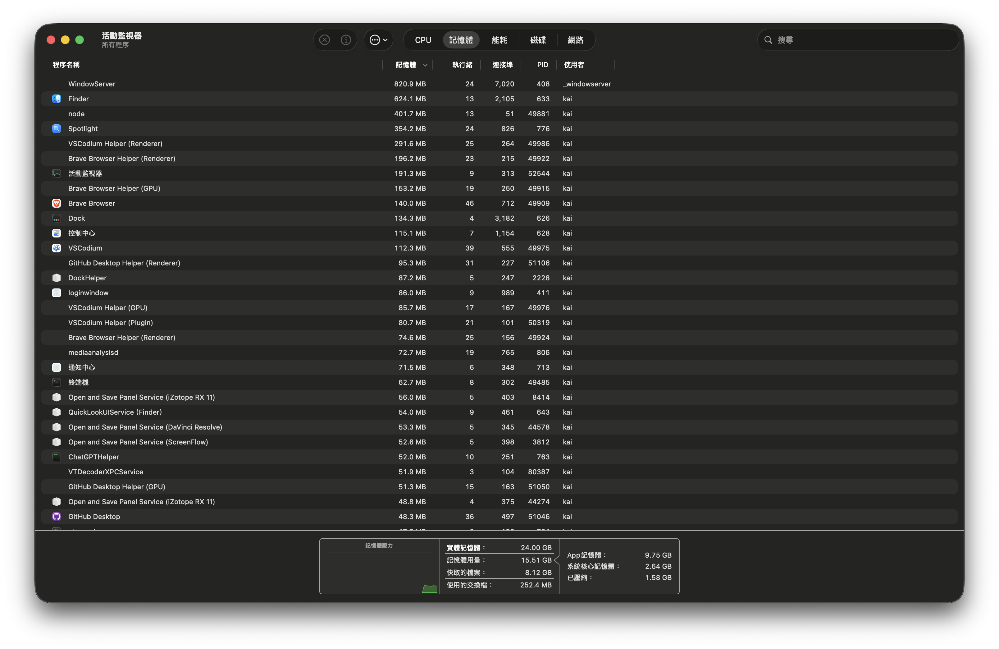
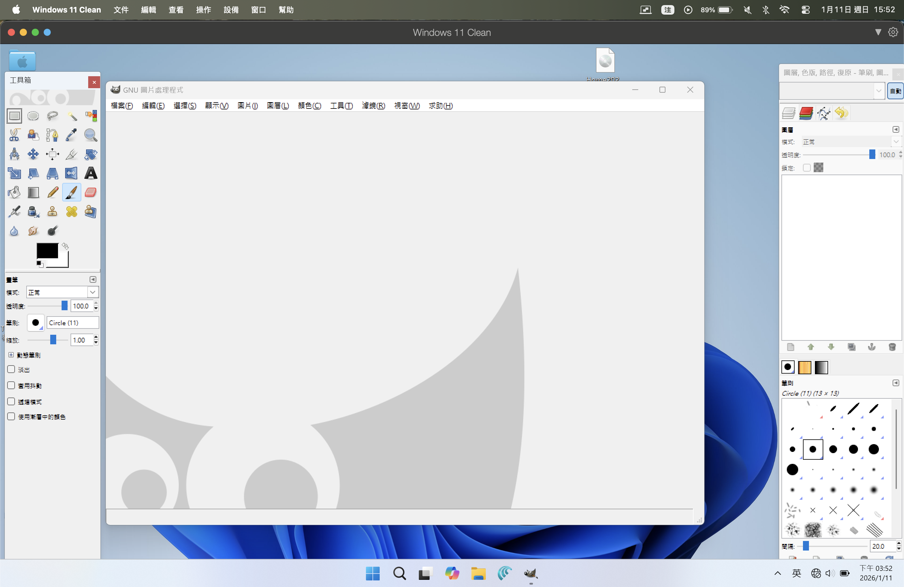

## 曾老師是誰？
曾老師是一位在新竹高中教學教了三十年

電腦課教學！真的很實用，上課內容超優質，優質到十年不變

## 曾老師的課程設計

首先教你怎麼使用搜尋引擎！
在教學過程中會不斷請你做筆記來記得怎麼使用搜尋引擎...

:::note 問題在於：
現在大多同學都直接使用AI
:::

## 搜尋引擎！

曾老師請你比對各大引擎！
像是：**Google**、**Bing**、**Yahoo**、甚至是**百度**...

不過我推薦你現在改成使用：DuckDuckGo 

### DuckDuckGo 哪隻鴨子？

他是一個保護隱私的搜尋引擎！
不知道你有沒有發現如果你用Google 搜尋用久了，會有以下現象：

- 很長影片會跳出你搜尋的東西... 
    > 像是我媽愛看短劇，就會有滿滿的短劇！
- 新聞會常看到自己喜歡的內容
    > 不會像我一開 `BBC` 看到美國政治、聖經之類的就想關掉了！
- AI 會時不時在任何地方出現！
    > 連地圖都可以有 AI ，問題是現在還不成熟！

以上絕對不會出現在 DuckDuckGo ! 你不用擔心自己資料被偷～

## 終端機使用！

曾老師請你學會怎麼用終端機!
問題是他只教學 `Windows` 版本的

說什麼 remove 指令...
- (不好意思 Mac / Linux 沒有！)

### 所以！
我強烈建議你學習`Linux`

### Linux 什麼企鵝？

我的軟體使用原則是，在可行的情況下，優先使用自由軟體或開源軟體

Linux 就不會有(很少)有病毒，而且系統記憶體才佔用 1GB
> 現在來看我 macOS 26 ! 哇～

:::tip 真的厲害了！
你們看下面記憶體佔用佔了 10GB ！
超級厲害～
:::

## GIMP 修圖
首先！之前 (上面有提到) 這個老師**十年不變！**

是的，各位現在 GIMP 都已經出到 3.XX 了

這老師還是堅持使用 2.6 !

:::danger 問題
請問我有最新 MacBook (M 晶片) 怎麼辦？
:::

老師回答：**自己看著辦!自己用虛擬機吧！**

我就問一個音樂班高中生是誰會用**虛擬機**?
> 我除外．．．😅😅😅

看看這個介面...十年後就淘汰了吧。

是的～上面虛擬機還要錢！💰

## 補充

最後印象深刻的課程內容～
- 第一堂講教室規則講了一小時
- 打字要求要 `15分鐘/每秒`，沒過要寫閱讀心得
- 很喜歡點特定號碼像是 `9號`
- 自稱自己的教材十年不變！
- 要求連兩堂且中間不下課~~才能讓大家眼睛壞掉~~ *才能讓大家大開眼界！*

> 給個小建議：先練好打字，然後上課要聽！

未來有機會出教學！：  `如何戰勝曾老師的課程，讓你不會被當！`