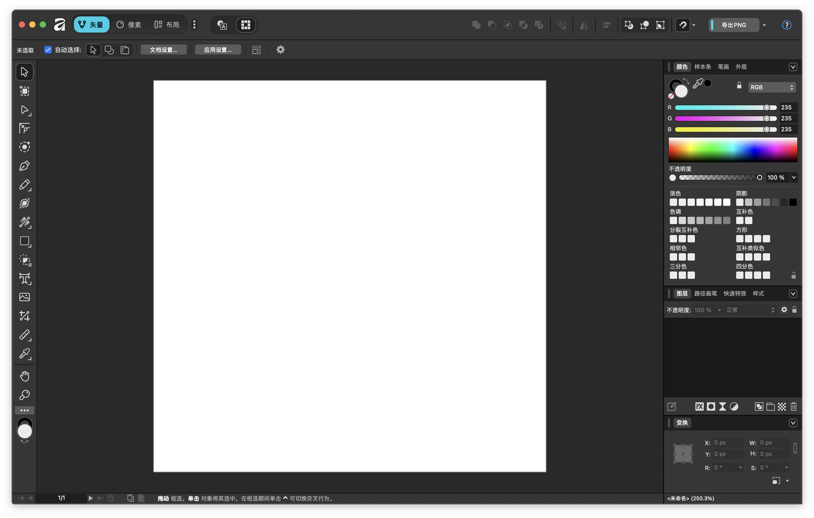

## 十年前...

在十年前，要修圖的話要花至少兩萬吧...
而且只有大名鼎鼎的 [Adobe](https://www.adobe.com/) 公司 專業等級的軟體 在網路上

{/* truncate */}

## 現在呢？

現在我隨便問問 AI 就列出超級多的～

## 現在

我自己是使用 `Affinity` 啦！雖然我沒用過 (或著說我很討厭) Adobe 的產品 ...

像是剪輯我用 `DaVinci Resolve`、製圖我用`Affinity`

> 喔對我 [電腦老師堅持要用十年的軟體](/blog/731pc)...也是很厲害啦！

## 好用嗎？

我只能說...超好用！我是沒用過 Adobe 的軟體，但是 Affinity 操作簡單、直觀
重點是 (除了 AI 功能) 免費！

