## 差點來不及

早餐吃 銅鑼燒 x2 +蔬果汁

`{/* truncate */}`

 

 
 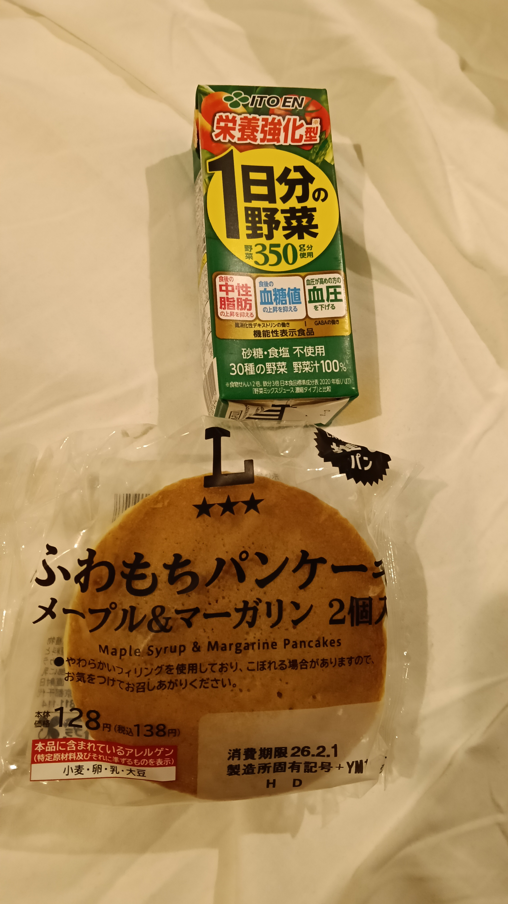 
 

搭 09：26 的新幹線，然後讓我想到：
昨天去領車票的時候，一位中年大叔問說有沒有 `reservation` ，因為真的很即時，完全忘記是甚麼意思🤣

後來查翻譯是：**預定**的意思

而 `reserve` 是 指定席 的意思

## 新幹線
喔對然後新幹線在上野站，所以我們必須進去 JR 改札

:::danger 注意
當初我們還以為要進去人工驗票，後來問站幅員，他說要把乘車票放入 **改札**
:::

### 第二難題

在上野站進去後，要在下手扶梯到 B1 ，然後又遇到另一個 改札！🤣

又問了一下，這次是 **兩張一起放進去**

在下面有自動販賣機，我爸說他曾經在這邊因為 **下大雪**，所以列車延遲抵達

結果我們在月台多等了 2 分鐘，新幹線好像蠻常遲到的（？

不過看了 APP 才發現今天甚麼都延遲🤣

 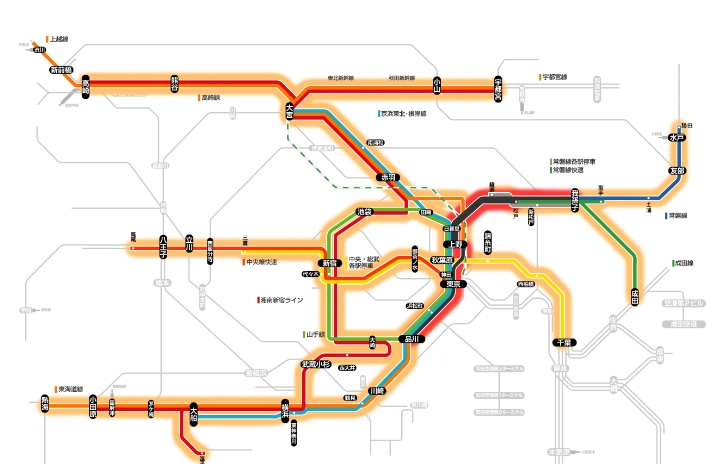 
 

### 搭乘體驗

整個新幹線暖氣開很強，希望等一下出去不要被冷到了！

然後進隧道過不久會耳鳴，一開始在上野到大宮的速度大概 80~100 ，後來逐漸飆高到 250 ，**最快達到 285**！

剛才突然停下來，然後列車長不到說了甚麼，又慢慢的加速！🤣

## 長野電鐵

沿路上 **風景不錯**，遠方的雪很好看！第一節是 指定席 要多加 300 元🤣

但是我們買二日卷，所以只能坐中間，建議搭特急列車，速度不會比較快但**中間站不停**🤣

### 午餐

午餐又吃 拉麵 🤣
這次是拉麵鍋，其實很好吃，但是有點鹹

這是昨天的一風堂拉麵
 

  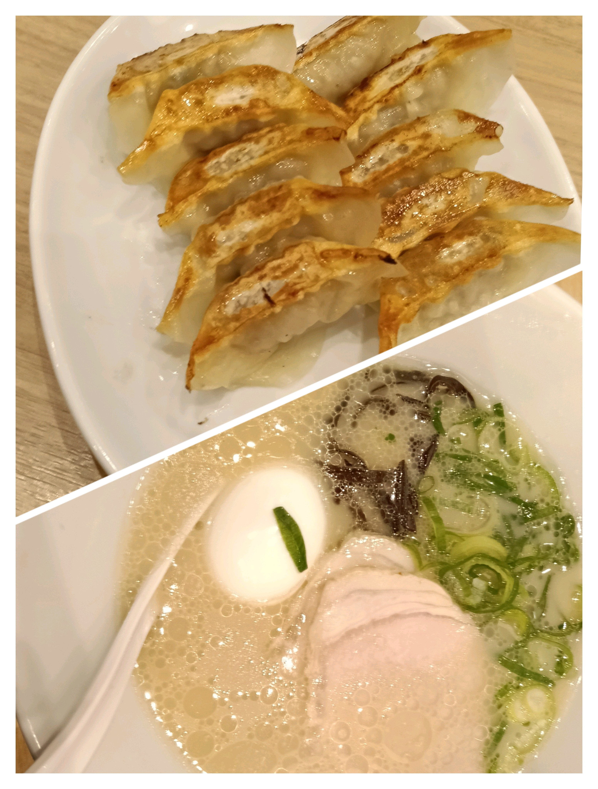 
  

這是今天的小布施拉麵

 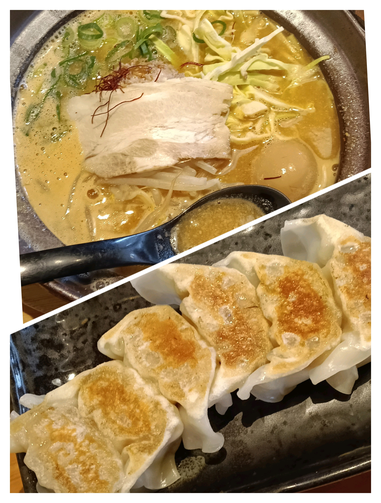 

都好吃！

## 小布施 走路
我們吃完午餐後，就是走走路，大概走了三公里至少🤣

基本上地板都是雪，不用懷疑，像你們現在看到的這樣

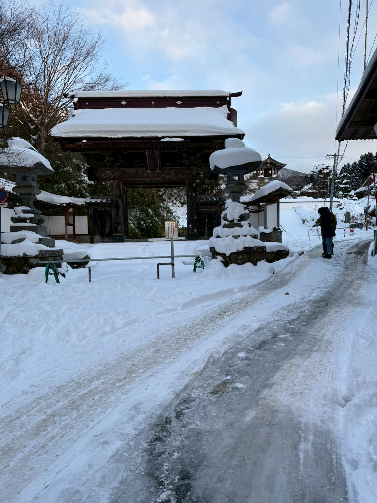

然後我好幾次差點在棕色的冰上面滑倒 (那真的很滑)🥲

### 吃冰

接著再這麼冷的天氣就是要吃冰！

所以…

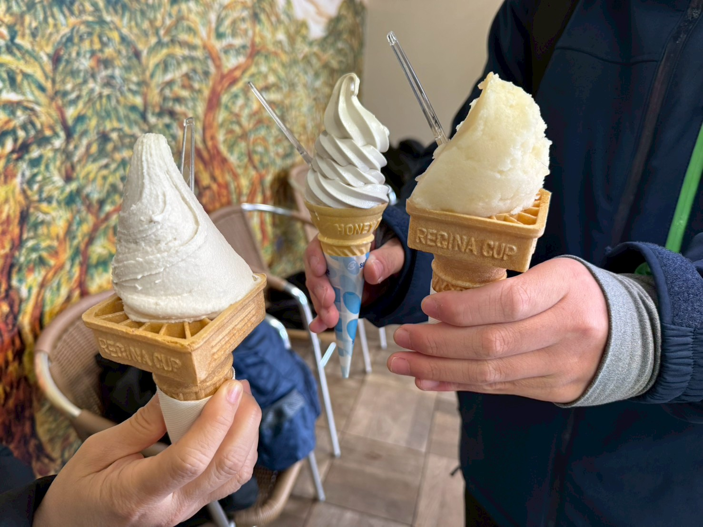

然後差點趕不上火車
## 湯田中
接著我們搭著巴士去飯店了！

[一乃湯 果亭](https://maps.app.goo.gl/VmpybsnGLNpxsZbn9)

### 飯店

一進去鞋子就被收走了🤣，然後就是穿著襪子踩他們的榻榻米…

一樣總結優缺點
:::tip 優點
1. 整體來說房間、廁所都很大
2. 晚餐特別 (請看下面)
3. 溫泉 有分男女，有分室內跟戶外
4. 有雪！！！！！！！！
:::
:::danger 缺點
1. 離東京市區較遠
2. 地板超冷 (泡湯前是拖鞋子走路的🤣🤣🤣
3. 房間燈稍微昏暗
4. 沒有浴室，是泡溫泉 (對不想泡溫泉的人來說沒有選擇)
:::

#### 想這個想很久哈哈哈哈哈哈

房間大概是這樣

 

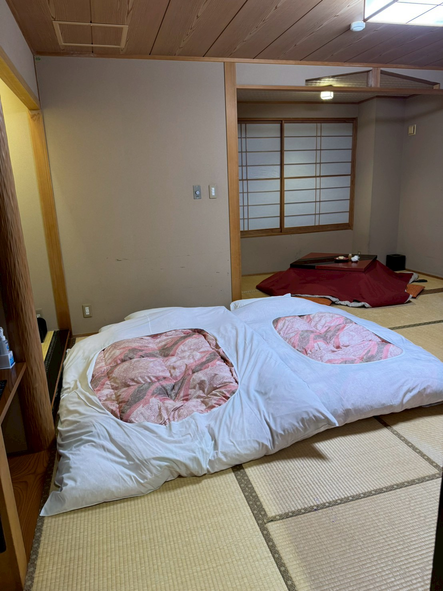

### 逛溫泉街

我努力的爬這個樓梯，上去景色超棒

**我手機不棒**🤣，但是大家一定要親自來看看
 

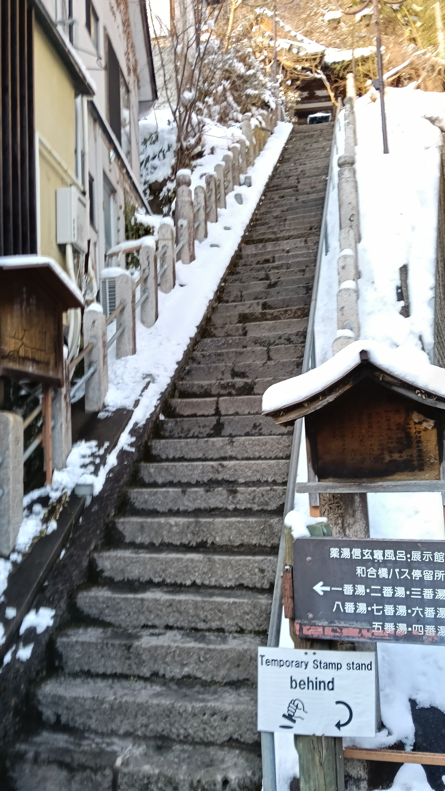

### 泡溫泉

去泡溫泉遇到外國人，我就問他：

Hi ! Where are you from ? 

他說：

> I am from France !

我心想：喔哇！外國人耶

然後他就說：

> 我會說中文

喔哇！我嚇到

他說：

> I am study Chinese right now !

喔對然後我就跟他說法文我只知道蹦啾而已

然後他笑得很開心嘿嘿 🤓

以上是泡溫泉前遇到的，很開心

然後，整棟有分 戶外跟室內，戶外超讚的！

> 有雪飄下來，然後外面風景好看！

### 飯店晚餐

好累，請原諒我打到這裡真的好累...

接著是飯店晚餐，我放圖就好了

 

 
  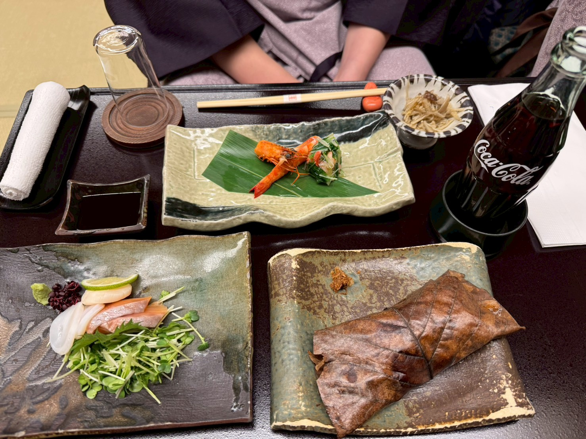

首先 中間綠色的是蝦子+不知道包起來是什麼，軟軟的，重點是好像有加醋，很好吃

接著是旁邊的生魚片、干貝、花枝 都好吃，加 Wasabe 更好吃！！！

然後是上面的 各種菇，他把它做成像是果凍一樣，涼涼的，**很適合當開胃菜**

最後是下面是~~我的可樂~~包起來很像粽子

長這樣:

 
 
 
 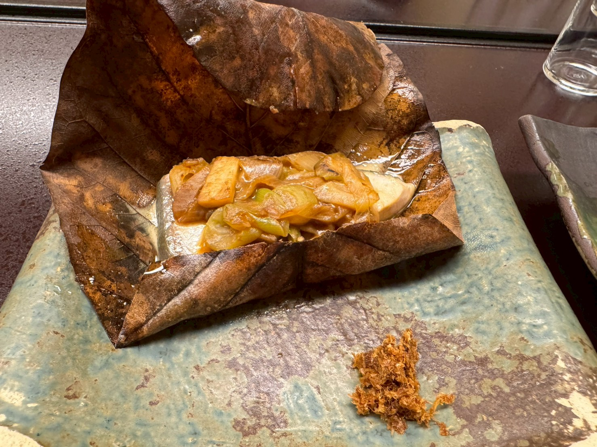 
 
 

裡面是魚，上面碎碎的我忘記是什麼了 😥

接著是 飯糰菇飯 跟 炸物

 
 
 
 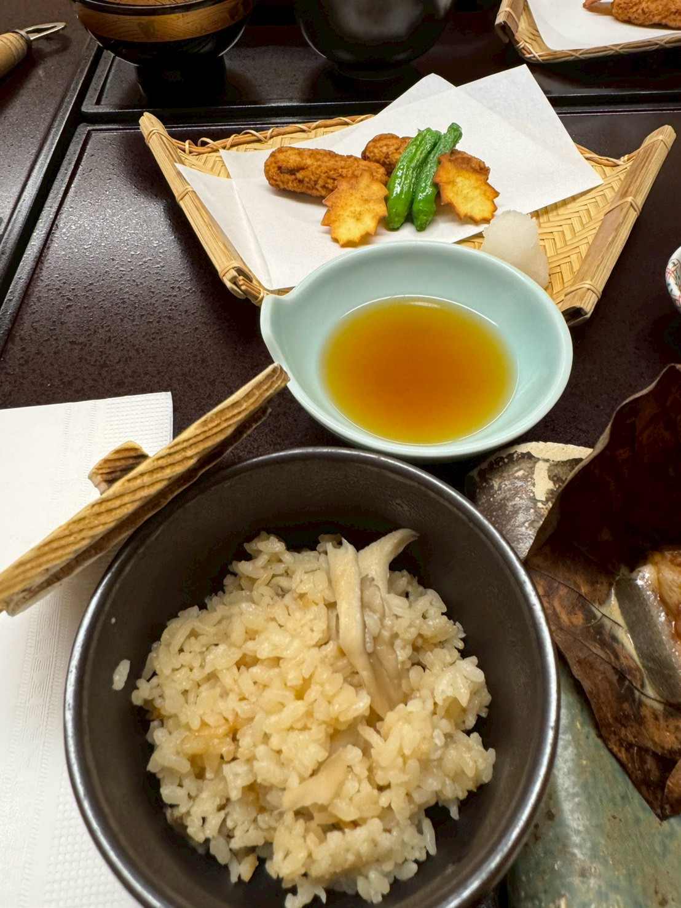
 
  

飯的話很香，有特制醬汁就是了，炸物的部分是炸魚，重點是 **旁邊的蘿蔔泥加醬油** 超好吃！

然後還有味噌湯

 
 
 
 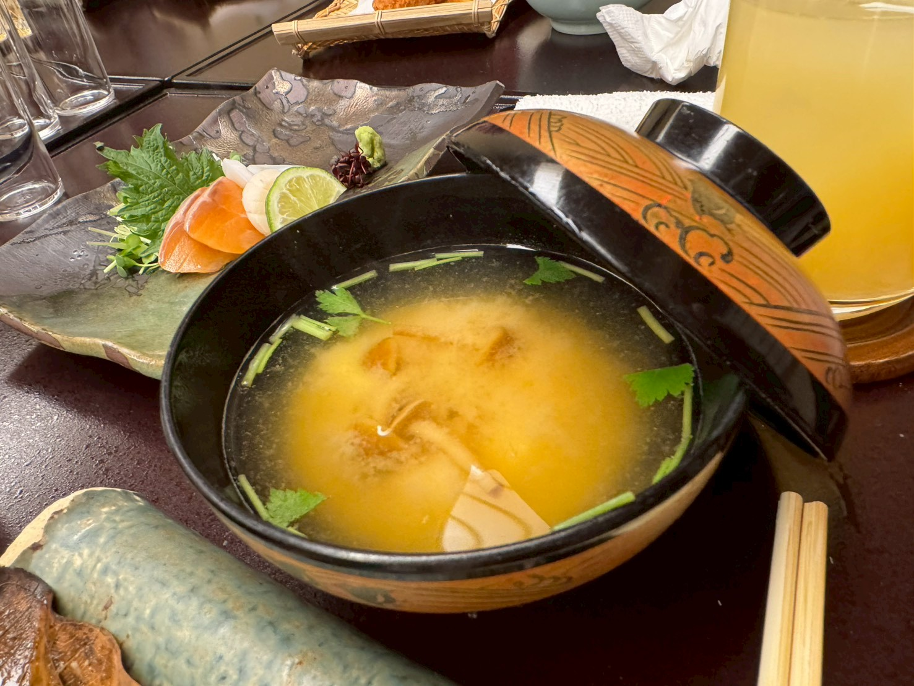
 
  

  

讓我想起來：我爸說他之前有一次在沖繩，然後他不知道怎麼開蓋子，結果店員叫他**把兩側的蓋子捏起來**，欸就開了 (不過在那之後我從來都沒遇過哈哈哈哈)

接著是 豆腐？

怎麼可能！這是用蕎麥麵做出來的！

欸又有瓦薩比，超好吃！！！
 
 
 
 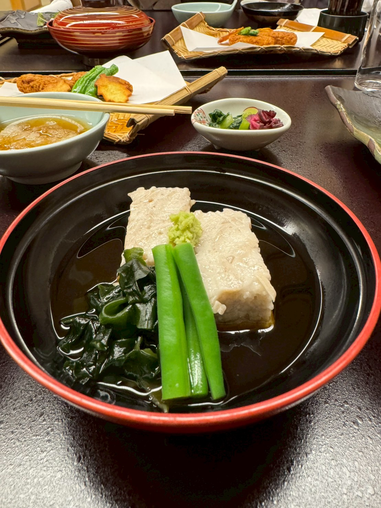
 
 

然後是 蛋？

當然不是，是馬鈴薯，周圍有雞肉，竹筍跟蛋液 (這道應該要配飯，因為很鹹)

 
 
 
 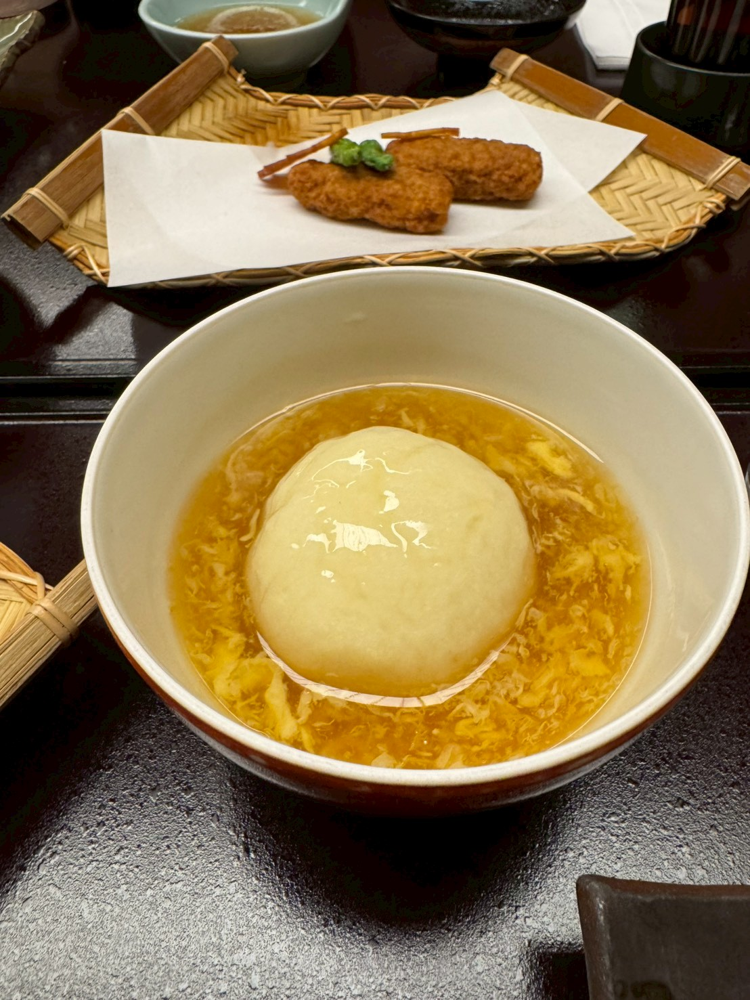
 
 

  

最後的現在回到房間，好累還要做這個網站…

感謝大家看到這！