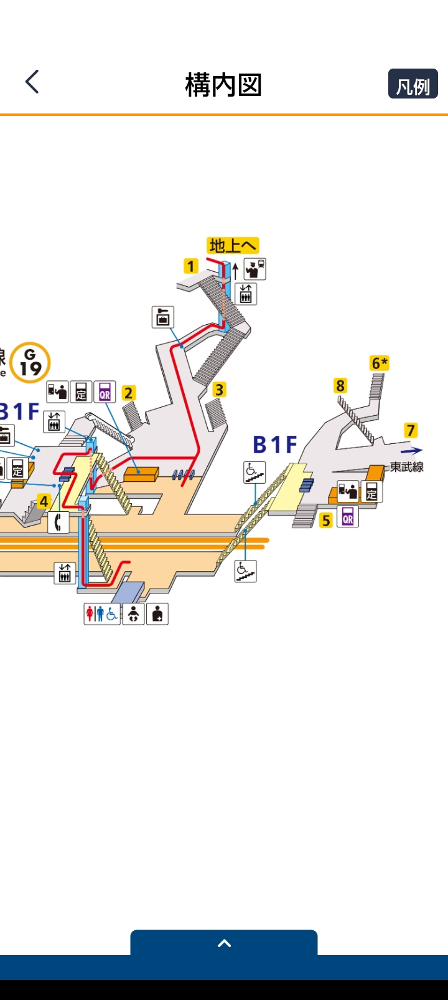
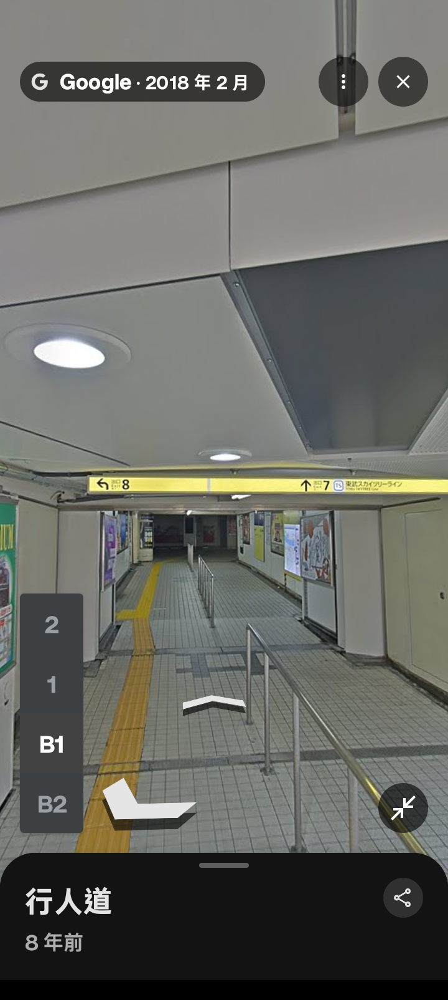
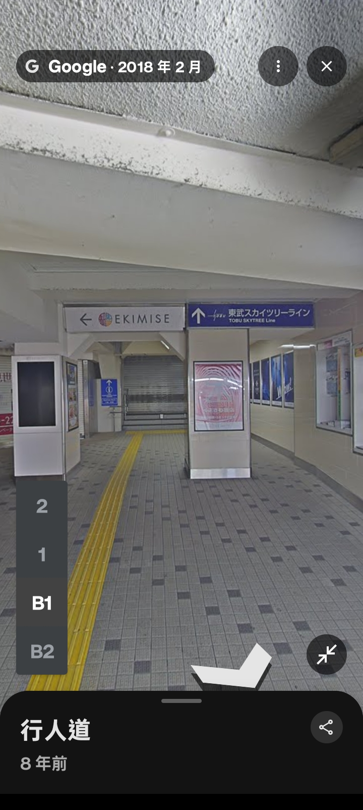

### 早安

今天這篇相當輕鬆，要來教我媽怎麼買順利地**在東京淺草買京都辣油**

### 第一步

首先，搭**銀座線**前往淺草！

不管搭到哪一班車，只要聽到：終點站是淺草，就要下車，**下車時請注意月台間隙**

## 下車後

不論那台車讓你在第一月台或者第二月台下車，請注意：**直直的往車頭前進**

:::danger 直到你看到樓梯
:::

### 請出站

接著，拿出珍貴的 西瓜卡，出站

向左轉或者找這重要的指標！**出口 7**

### 超市

一直直直走就可以到 該超市，是不是很簡單

祝大家順利買到自己想買的東西！