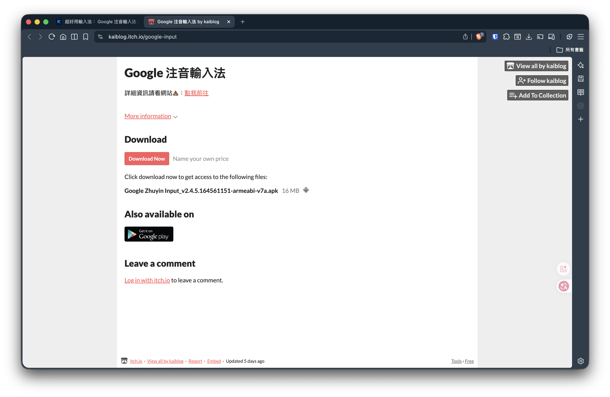

## 前言
他是一個超級好用的網站！原本是提供給那些**想放自己做的遊戲給其他人玩的平台**，讓他們可以在該平台賺取一些小費！不同於 `Gumroad` 這種抽成平台，itch.io 是完全開源的！

結果他被我拿來放我給大家的素材，像是這幾天筆記更新的：[Google 注音輸入法超好用 APP](/docs/phone/google-input)

## 為什麼要用？
其實我都是提供免費的給大家下載，但是用這種買賣平台的原因：
1. 讓你感覺有買東西的感覺
2. 可以小額贊助我，心裡不會過意不過去

他的介面**超級簡單**,而且重點是免費!

然後下載速度超快!

#### > **不要再用 Google Drive 了**,用這個!

## 留言版:
:::danger 嘿嘿
只能說很好用!
:::
---
:::danger 曾老師
老師自己的 **~~三年~~ `十年不變教材`** 都用這個!
:::
---
:::danger 五月天阿信
總有一天 `五月天` 會在上面出新專輯
:::
---
:::danger 邦邦
老師的帥照都被同學放在上面,趕快刪掉!
:::

以上感謝大家踴躍發言 💬 

> 》(純屬娛樂)

