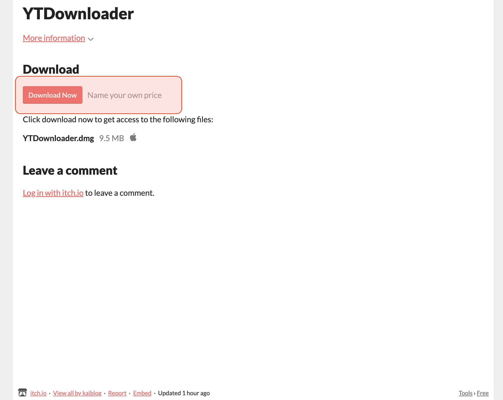
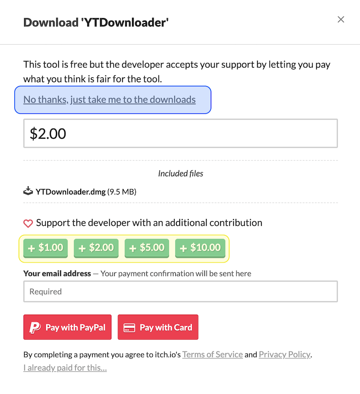
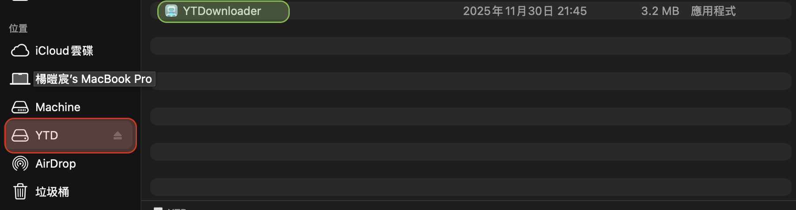

:::danger 找了老半天... 還是被我找到了 💩 
[搞不好比我的還好用](https://github.com/aandrew-me/ytDownloader)
:::
## 前言

每次要用 `YT-DLP` 下載 YouTube 影片的時候 , 都得用很複雜的指令... 像是:
``` md
yt-dlp --no-playlist -o '/Users/kai/Movies/YTDownload/music/%(title)s.%(ext)s' -x --audio-format 'mp3'  'https://youtu.be/QVy1UhwQvvA?si=cPbgTr6p7C2nLCMW'
```

打久了真的很煩...

## 開發

於是在 `這部影片` 的啟發... 
> 終於 ! 與 AI 開發了 YouTube 影片下載神器，超級好用！！！！


<div class="youtube-s">

<iframe width="560" height="315" src="https://www.youtube.com/embed/6FFiUREaHS4?si=Mft3IOdOZhha7NfQ" title="YouTube video player" frameborder="0" allow="accelerometer; autoplay; clipboard-write; encrypted-media; gyroscope; picture-in-picture; web-share" referrerpolicy="strict-origin-when-cross-origin" allowfullscreen></iframe>

<p>沒學過程式也能上架？用 AI 「講中文」結果竟然真的上架一款 App！【附模板】｜⊿</p>
</div>

## 下載方式

直接按 `Download Now` 
<div class="photo-border">



</div>

:::tip 接著有兩種方案：
1. 直接下載 **按下 藍色框框裡面的 No thanks, just take me to the downloads**
2. 小額贊助我！ **按下 黃色框框裡面的:**
+ $1.00
+ $2.00
+ $5.00
+ $10.00
**可自選**

<div class="photo-border">

</div>
:::

接著直接按下載！

### 安裝方式

:::tip 超簡單
1. 在下面找到：`位置` 
2. 點開：`YTD`
3. 將裡面的 應用程式拉到 `Appliction (應用程式)` 資料夾
4. 開始使用 !

<div class="photo-border">

</div>

:::

### 使用方式

:::danger 注意 ⚠️
1. 右鍵 -> 貼上 (command + V **沒用**)
2. 選擇是否 **下載整個播放清單**
3. 選擇 **下載類型**
4. 選擇 **字幕語言**
5. 選擇 **解析度**
6. 選擇 **輸出格式**
<p style={{ marginTop: '8px', marginbottom: '0.1px' ,fontSize: '0.85rem', color: 'var(--ifm-color-emphasis-600)', opacity: 0.8, textAlign: 'left' }}> ※ 輸出格式需與下載類型相同 </p>

7. 選擇 **下載儲存位置**

:::


### 遺憾

不過最近發現好像又被YouTube擋住了,可能大家要再觀察一下