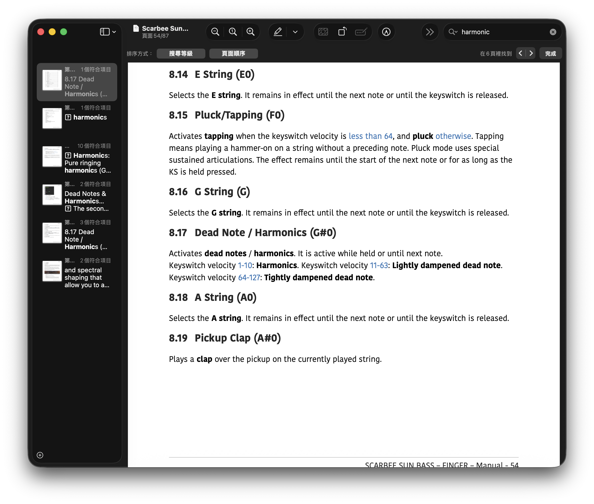

嗯... 情人節快樂
:::tip 祝 : 每天都可以快快樂樂的 !
:::

寫一下今日筆記

{/* truncate */}

### 編曲: Bass 製作

使用 `The Rain Must Fall` 的 Bass SOLO 練習

<iframe width="560" height="315" src="https://www.youtube.com/embed/Iq3zo432sAU?si=PpERnK406q-UbsGW" title="YouTube video player" frameborder="0" allow="accelerometer; autoplay; clipboard-write; encrypted-media; gyroscope; picture-in-picture; web-share" referrerpolicy="strict-origin-when-cross-origin" allowfullscreen></iframe>

Yanni - The Rain Must Fall Bass 製作 > 4：03~5：17

### 滑音製作
1. 音符重疊
2. 使用 CC64 踏板拉高到 127
3. Velocity 會影響

### Kontakt Scrabee Sun Bass
滑音製作
1. 音符重疊
2. 使用 D#0 KEY 製作 滑音效果
Pitch Bend
1. 調整 CC PC
2. 形狀 - 三角形
泛音製作
- G#0 + 該音 `Velocity` 1 ~ 10 

## HOW TO 解決問題

> 參考 User Manual

### 其他

快樂過年 🧨