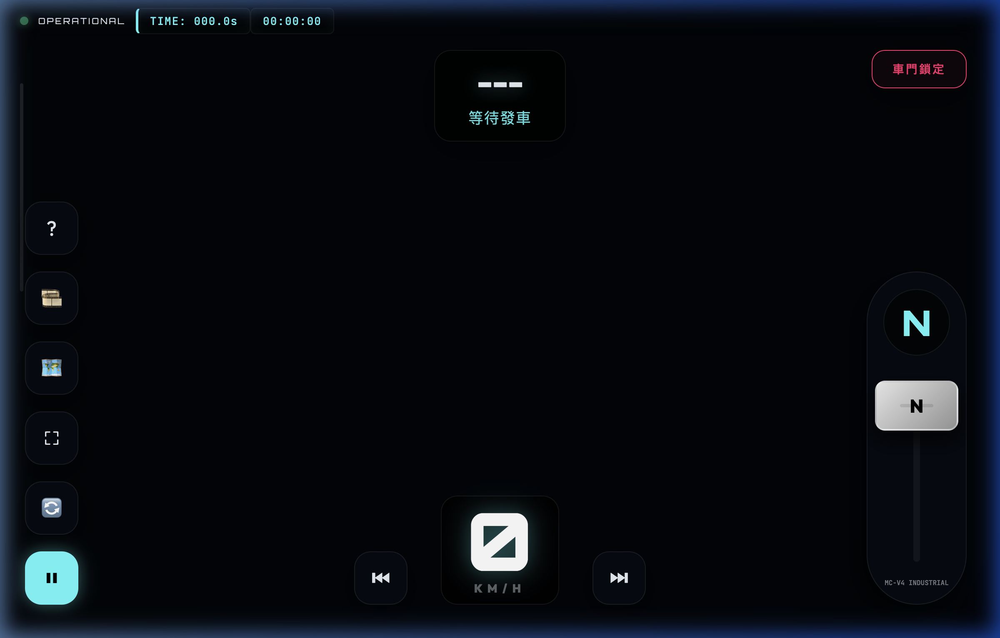

今天針對 **Train EMU 模擬器** 進行了一系列重要的優化，主要是為了提升手動駕駛的真實感，並修正了一些數據讀取上的邏輯問題。

### 🚂 主要更新亮點

#### 1. 門控與影片暫停邏輯優化
為了讓離站過程更自然，我調整了影片暫停的邏輯。現在當門完全關閉後，系統會等待 **10 秒鐘** 再暫停影片（或是繼續播放），這讓列車在出發時的視角切換更加平滑，不會有突然中斷的感覺。

#### 2. 加速物理優化
之前在低速（10 km/h 以下）時，手動駕駛的加速感略顯遲鈍。現在我將 10 km/h 以下的播放速率設定為固定的 **1.0x**，解決了起步緩慢的問題。

#### 3. 自動化數據更新
現在到站與離站的時間對比會根據**手動開關門**的操作自動更新，這大大減少了手動輸入數據的錯誤，讓調度更精確。

#### 4. 山手線數據預載入
目前的模擬器已經預載了 **山手線 (Yamanote Line)** 的各項站點數據，包含「有樂町 (JY30)」與「東京 (JY01)」，玩家進場後就能直接選擇路線開始駕駛。

### 🛠️ UI 與 功能修正
- **數據載入取消功能**：在載入 JSON 數據時增加了「取消」選項，避免不小心點錯後必須重整頁面的困擾。
- **全方位鍵盤快捷鍵**：現在可以透過快捷鍵（Z, A, S, Y, Q, E, F, X）來控制全車功能，包含門控、廣播與動力控制。

這次更新後，整個模擬器更趨於「專業駕駛導向」，移除了之前不穩定的 AI 輔助，回歸純粹的手動駕駛樂趣。

大家快去體驗看看吧！👉 [Train EMU 模擬器](https://kai980621.github.io/Train_EMU/)
