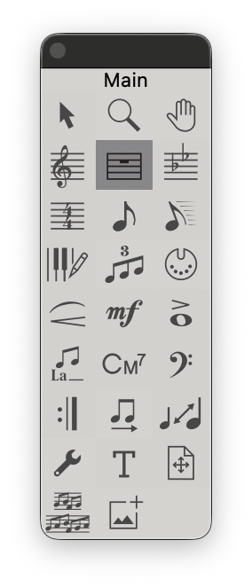

:::danger 在小節選中的狀態，選中該工具可使用 `Enter` 來開啟設定視窗
:::

 

該工具可以調整 `小節屬性`

---

 

名詞解釋

- Measure Attributes：小節屬性
用來控制「指定小節 的外觀、行為與顯示方式」
- Measure Attributes for Measure：套用小節範圍
例如：1 through 31，代表第 1 小節到第 31 小節
- Change Every：每幾小節套用一次
常用於規律重複的版面設定

---

Barline（小節線）

設定「這個小節的右側小節線樣式」
- Normal：一般小節線
- Double：雙線
- Final：終止線
- Solid：粗線
- Dashed：虛線
- Invisible：隱形小節線
- Tick：短小節線
- Custom：自訂樣式

---

Left Barline（左側小節線）

設定「這個小節左邊的小節線」
- Default：跟隨系統設定
- Normal / Double / Final / Solid / Dashed / Invisible / Custom
👉 功能同上，但只影響左邊
- Override Group Barlines：覆蓋群組小節線
👉 常用在特殊段落、現代音樂

---

Display（顯示設定）
- Width：小節寬度
- Change To：直接指定寬度（例如 0.875）
- Add：在原本寬度上加減
- Extra Space：額外空間
- At Beginning：小節前
- At End：小節後
- Key Signature：調號顯示方式
- Show if Needed：需要時才顯示
- Time Signature：拍號顯示方式
- Show if Needed：需要時才顯示
- Hide Cautionary Clefs, Key and Time Signatures
：隱藏提示用的譜號／調號／拍號
- Position Notes：音符位置
- no change：不改變
- Evenly Across Measure：音符平均分佈於小節內

---

Behavior（行為）
- Begin a New Staff System：從此小節開始新系統
👉 強制換行（超常用）
- Show Full Staff & Group Names：顯示完整譜名
- Break a Multimeasure Rest：打斷多小節休止符
- Break Smart Word Extensions：中斷歌詞延伸線
- Include in Measure Numbering：列入小節編號
👉 常被拿來做「隱藏但仍計數的小節」
- Allow Horizontal Split Points：允許橫向分割點
（進階排版用）

---

:::tip 教學小技巧
- 要「指定這一行一定要換行」👉 勾 Begin a New Staff System
- 要做「不顯示但小節號不亂掉」👉 開 Include in Measure Numbering
- 聽寫或考試譜，常會調整 Width 讓空間更平均
:::

---

### 小技巧

 • 可使用該點：移動小節

