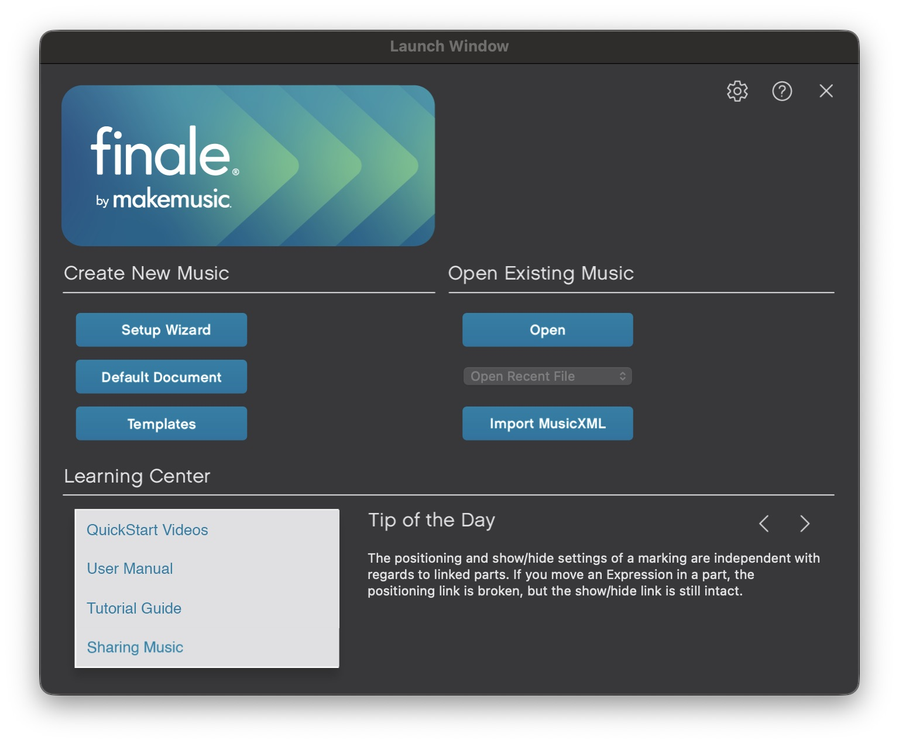
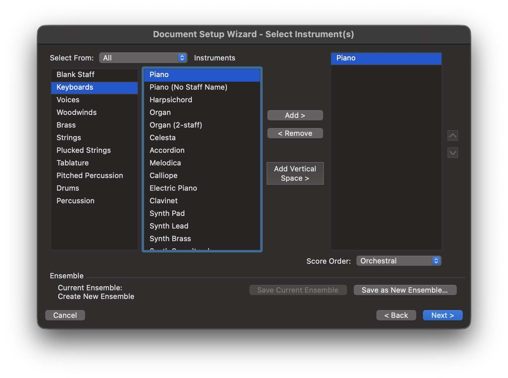
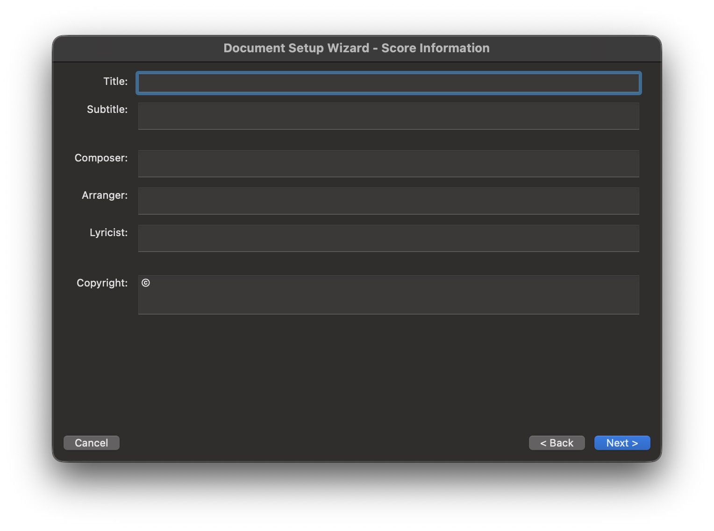
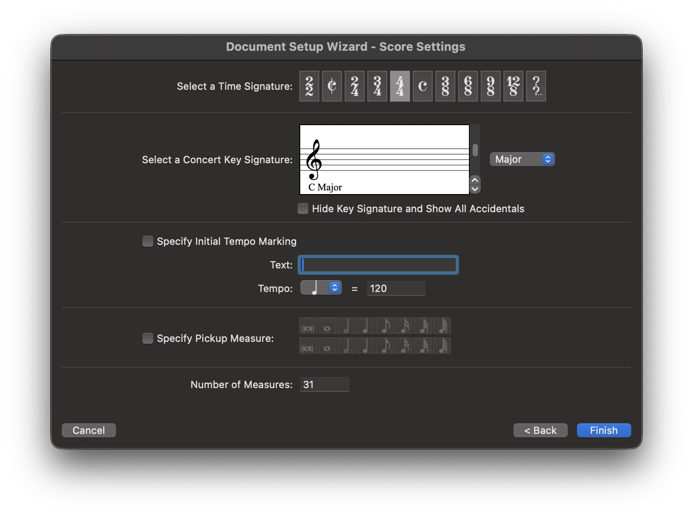
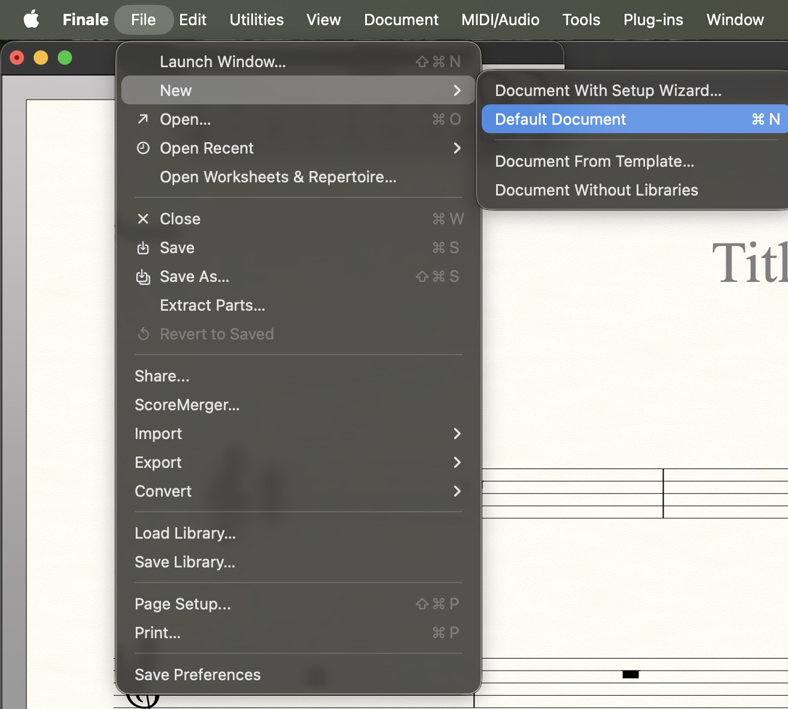
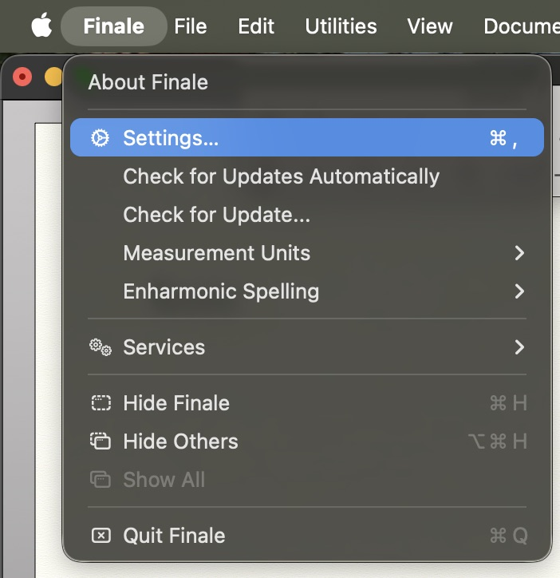
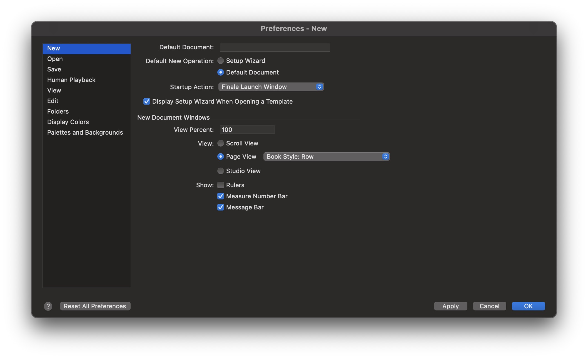
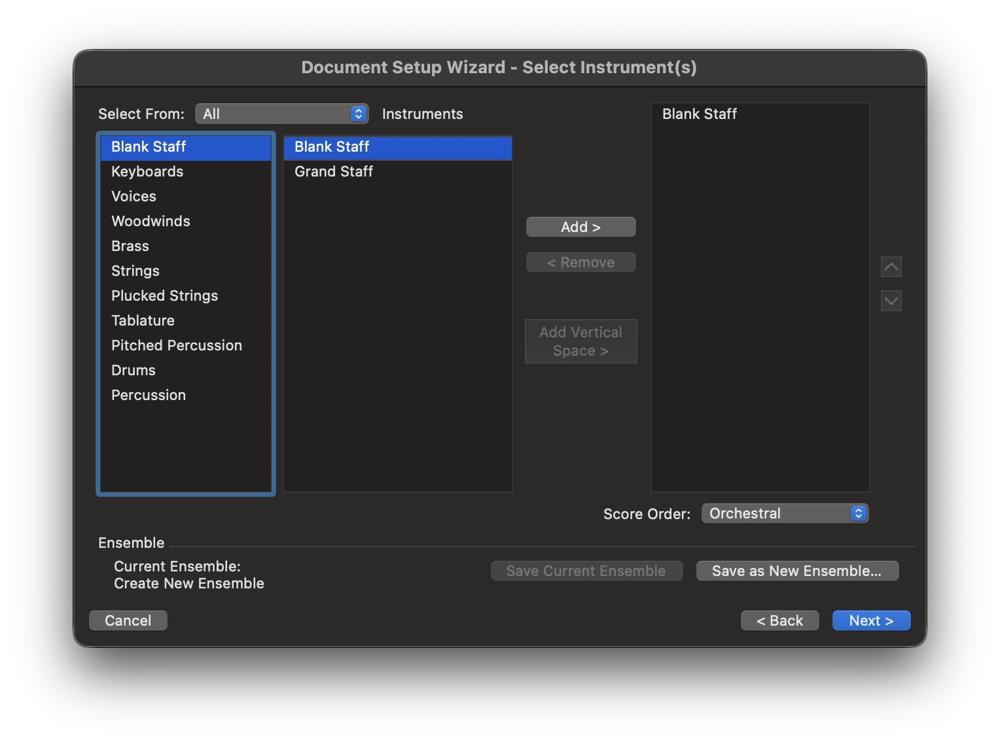

## 怎麼建立新專案？

首先開啟 Finale 之後，可透過上面的 Setup-Wizard 建立新專案

## 第一頁為選擇模板

    不過建議養成好習慣是：
:::danger 注意！

**不要使用模板**

:::

- **直接**按 `Next` (或著`Enter`)

## 選擇樂器
接下來是選擇樂器！選擇要的樂器後按`Add`加入或著`Remove`移除

- **繼續**按 `Next` (或著`Enter`)

## 樂譜資訊
這邊建議什麼都不要填，除非你怕有人拿這譜去販售 🤣🤣

:::tip 名詞解釋
- Title: `標題`
- Subtitle: `次標題`
- Composer: `作曲家`
- Arranger: `編曲家`
- Lyricist: `填詞者`
- Copyright: `版權資訊`
:::

## 樂譜屬性
這邊建議什麼都不要改，如果你有強迫症建議把預設小節數：`31` 改成 任何整數

然後建議讓 `樂譜速度` 顯示！
- 這樣隨時可以修改速度

> 按 `Finish` (或著`Enter`) 完成建立樂譜！

## 快速新增五線譜

這樣皆算是快速設定，我是習慣直接建立空白五線譜
可以到上面選單列
> file - New - Default Document

## 快捷鍵設定
#### 你會發現在上面我有設定快捷鍵 `⌘+N`！只要開好 Finale，直接按快捷鍵就好了超爽！
:::warning 注意
預設快捷鍵：`⌘+N` 是開啟`Setup-Wizard` 
:::
- 步驟一：找到設定！

- 步驟二：修改Default New Operation為
`Default Document`

- 下面記得按 Apply
## 補充！
在這設定當中：
:::tip 名詞解釋
    - Blank Staff: `單一行譜表` 
    - Grand Staff: `鋼琴大譜表` 
:::
