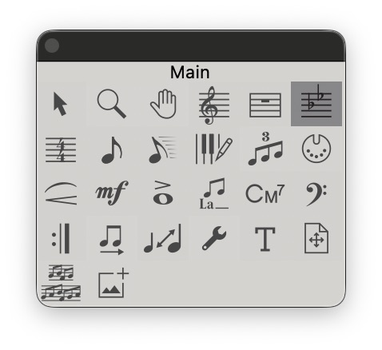
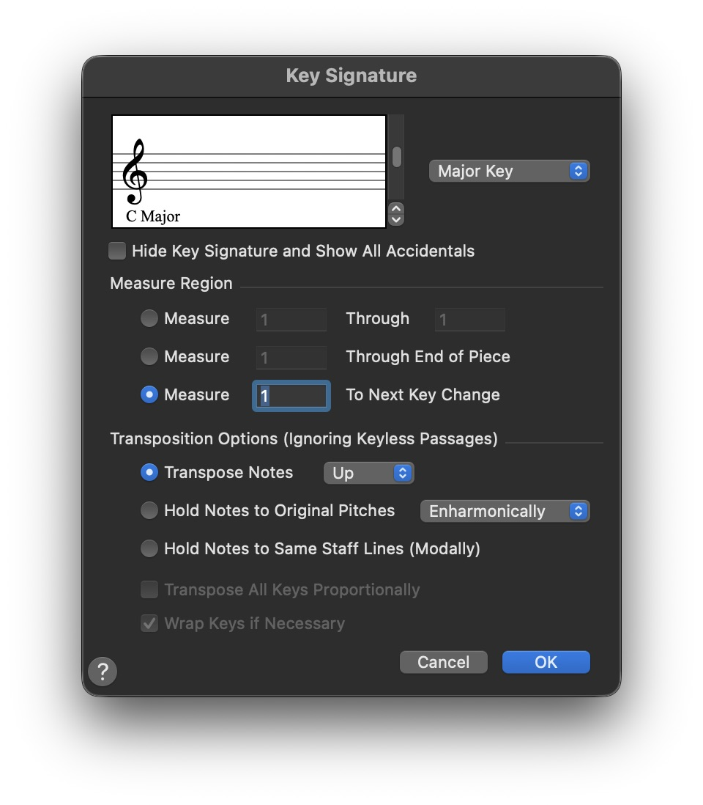
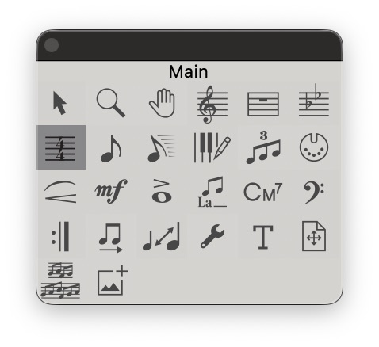
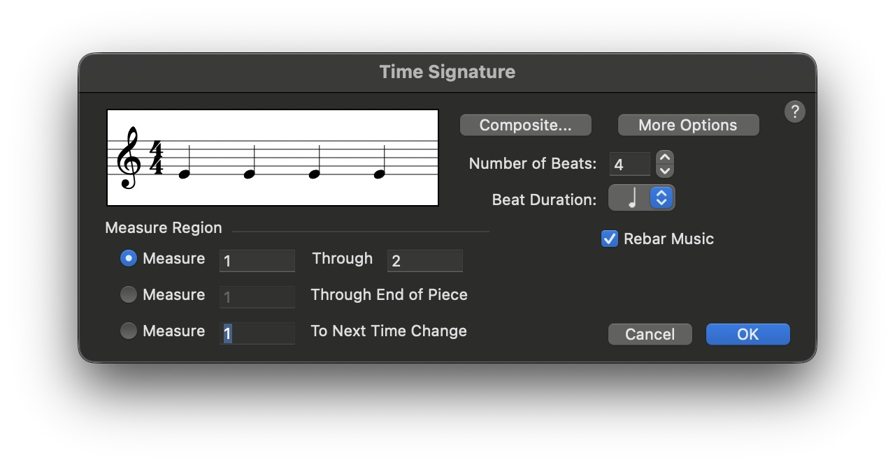

## 調號
:::danger 在小節選中的狀態，選中該工具可使用 `Enter` 來開啟設定視窗
:::

該工具可以調整 `調號屬性`

---

名詞解釋

### 換調號

如果你照著我之前一樣不用快速設定，而是直接建立新文件...

這邊就會更加印象怎麼換調號

- 箭頭可以較精準控制調號

    - <kbd>Up</kbd> : 越升
    - <kbd>Down</kbd> : 越降
- Hide Key Signature and Show All Accidentals：隱藏調號顯示臨時記號！
---
:::tip 建議選擇預設不變！
Measure Region：
To Next Key Change

:::

### 是否移調！

Transposition Options (Ignoring Keyless Passages) - 轉調選項！

- Transpose Notes `UP` - `將位移所有音符` 可選擇往上或下！
- Hold Notes to Original Pitches `Enharmonically` - `保持原本音高` 可選擇是否影響臨時記號
- Hold Notes to Same Staff Lines (Modally) - 這個不常用哈哈哈哈

## 拍號

:::danger 在小節選中的狀態，選中該工具可使用 `Enter` 來開啟設定視窗
:::

該工具可以調整 `調號屬性`

---

名詞解釋

### 換拍號

如果你照著我之前一樣不用快速設定，而是直接建立新文件...

這邊就會更加印象怎麼換拍號 🤣

#### Composite... 
- 使用 `4/4` + `2/4`拍的變化拍

可設定，下面為範例！

- Number of Beats: 幾拍子！
- Beat Duration: 時長(可選四分音符、八分...) 

:::tip 範例
若選擇 
- Number of Beats: 6
- Beat Duration: **八分音符** 

會變成 `6/8` 拍
:::
---
:::danger 一樣！！！
:::tip 建議選擇預設不變！
Measure Region：
> Measure 1 Through 2

:::
:::
