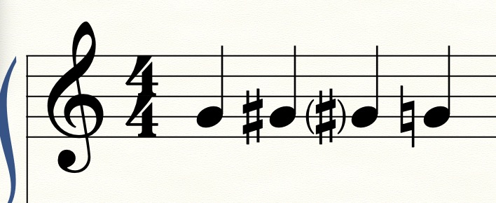
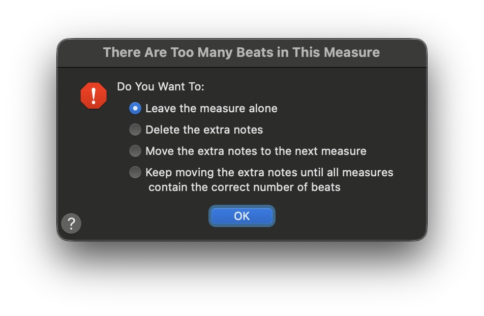
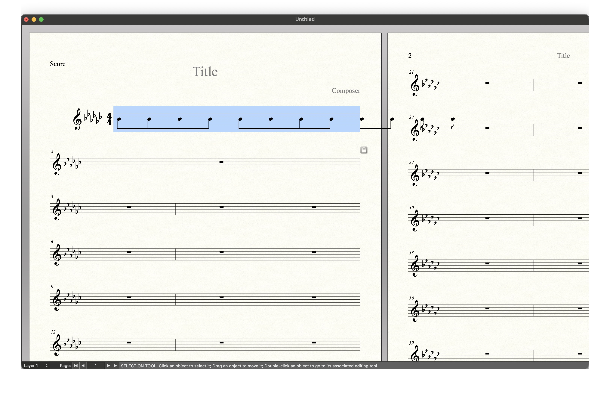
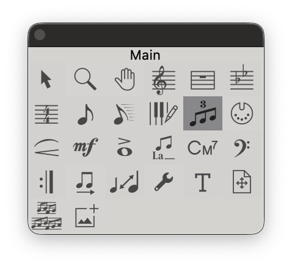
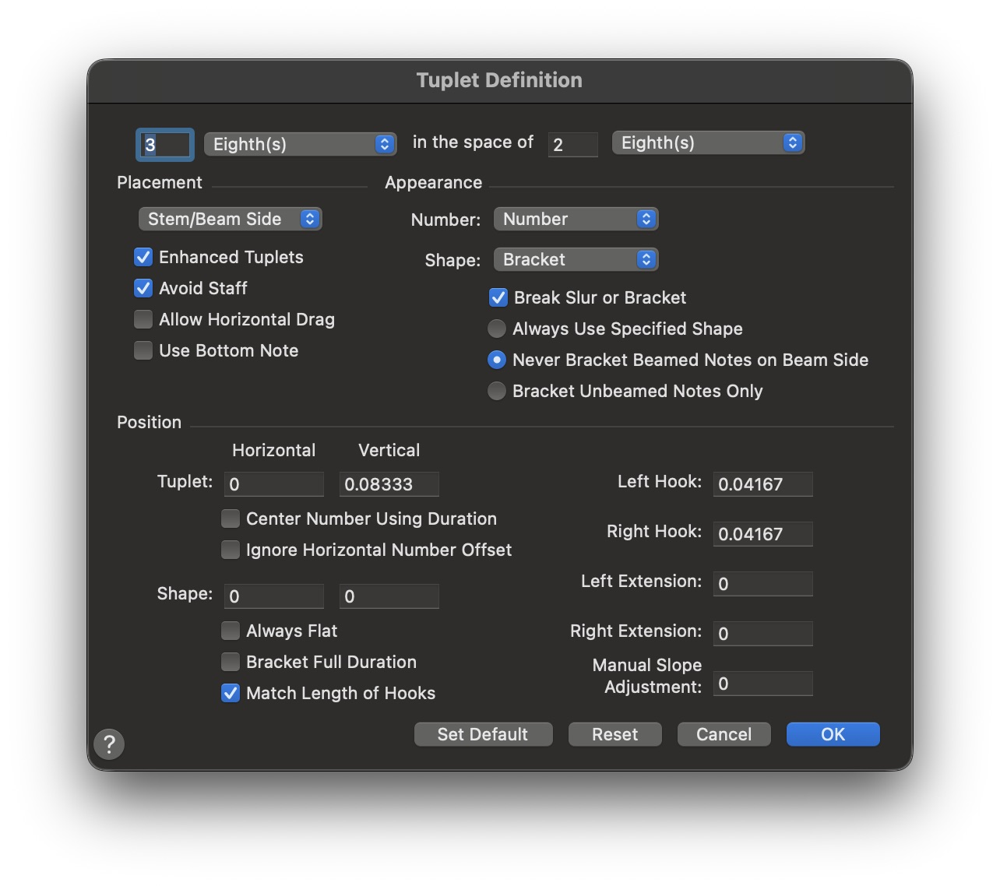

## 認識介面

先認識介面吧！

> 名詞解釋
- ScoreManager：`樂譜管理器`

:::tip 技巧
下面你看到的一個大視窗，就是他！它可以讓你新增樂器，甚至載入自己的 `VST`
:::

- Mixer：`混音器`
:::tip 技巧
在這當中，可以調整個別樂器聲音～
許多聽寫出題老師會故意把拍點調小聲
:::

- Playback Controls：`播放控制區`
:::tip 技巧
在這當中，可以播放樂譜！
常常會想要重中間聽，就從這裡調整
:::
- Main Tool Palette ：`主要編輯工具`
:::tip 所有編輯相館都在這裡！
:::
- Simple Entry Palette：`音符工具`
- Simple Entry Rests Palette：`休止符工具`
- Smart Shape Palette：`繪製工具`
- Special Tools Palette：`特殊工具`

:::tip 以上除了 `Smart Shape Palette` 其他皆使用快捷鍵完成！
:::

:::danger 我的預設！
基本上我只會開：
- `Playback Controls`
- `Main Tool Palette`
- `Simple Entry Palette`
- `Smart Shape Palette`
:::
在 Finale 當中，要怎麼輸入音符呢？
- - -
## 使用 Speedy Tool

在畫面中有看到超帥的工具！就是他～(自帶幾條線🤣)

- - -

### 選擇音高
接著點選要輸入的小節，
- 使用上下方向鍵<kbd>Up</kbd> + <kbd>Down</kbd> **選擇音高**
- 使用左右方向鍵<kbd>Left</kbd> + <kbd>Right</kbd> **切換小節**

- - -
### 選擇節奏
鍵盤上的：`1`、`2`、`3`、`4`、`5`
- 八分音符是 `4`
- 四分音符是 `5`
依此類推～

> 備註：按 `.` 是附點

- - -
### 臨時記號
- 簡單記憶：
    - #：`+` (<kbd>Shift</kbd> + <kbd>=</kbd>)
    - b：`-` 
    - x：按兩次 `+` (<kbd>Shift</kbd> + <kbd>=</kbd>)
    - bb：按兩次 `-`
- 超級好用：
    - #：`S`
    - b：`F`
    - X：`X`
    - bb：`V`

括號包含臨時記號：`P`

- - -
### 其他操作
- 刪除音符:`BackSpace`
- 刪除該音符(保留其他 `和弦音`) : `Shift + BackSpace`
- 休止符 : `R`
- 連結線 : `T`/ `=`
- 隱藏音符 : `O` 或著 `H`
- 符桿上下位置 : `L`
- 裝飾音 : `G`
- 分開（分割八分音符）/ 
- 切換到下一個樂器 (<kbd>Enter</kbd>)
- 切換到上一個樂器 (<kbd>Shift</kbd> + <kbd>Enter</kbd>)

### 輸入三連音！！

- 先輸入八分音符三個！

我輸入了四組，會出現錯誤！！

:::danger 不要理他，按OK
- Leave the measure alone - 保留多打的音
- Delete the extra notes - 刪除多打的音
- Move the extra notes to the next measure - 將多打的音移動到下一小節
- Keep moving the extra notes until all measures contain the correct number of beats - 將多打的音移動到下一小節，直到移動完畢！
:::
> 在這邊選擇 `Leave the measure alone` 然後就會...

非常之醜！

---

#### 選擇三連音工具

使用三連音工具！

在 **第一個** 八分音符上面按兩下！

會跳出一個框框

:::tip 解釋
- 3 Eighth(s) in the space of 2 Eighth(s) - 前者是 `幾` 連音，後者我不知道 😅
:::

- 直接按 `Enter`

