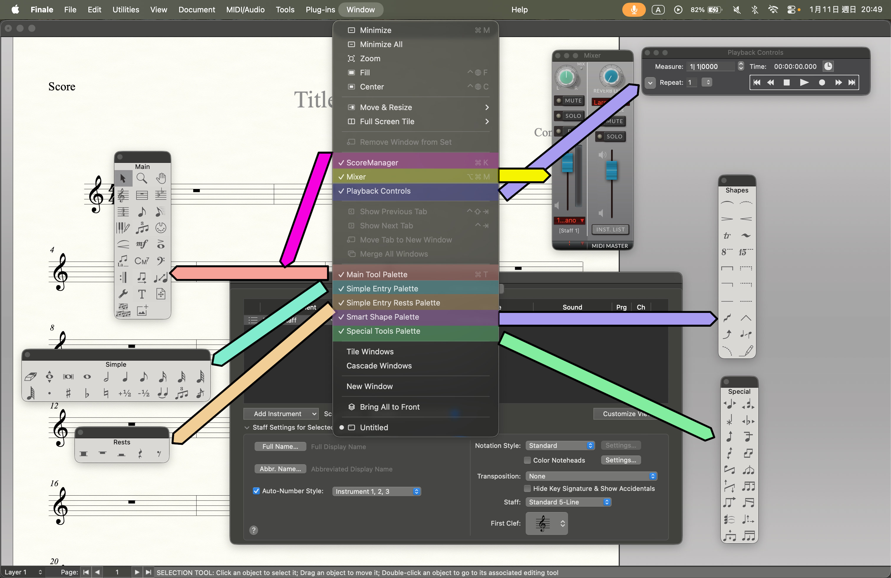
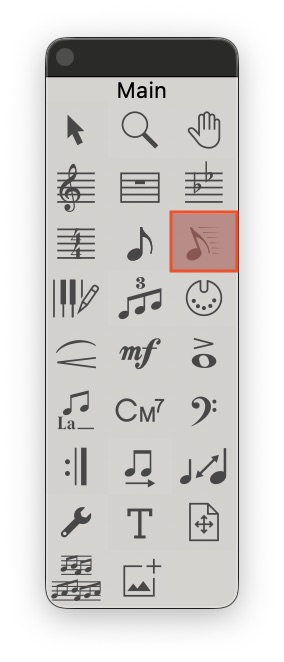

## 認識介面

先認識介面吧！

> 名詞解釋
- ScoreManager：`樂譜管理器`

:::tip 技巧
下面你看到的一個大視窗，就是他！它可以讓你新增樂器，甚至載入自己的 `VST`
:::

- Mixer：`混音器`
:::tip 技巧
在這當中，可以調整個別樂器聲音～
許多聽寫出題老師會故意把拍點調小聲
:::

- Playback Controls：`播放控制區`
:::tip 技巧
在這當中，可以播放樂譜！
常常會想要重中間聽，就從這裡調整
:::
- Main Tool Palette ：`主要編輯工具`
:::tip 所有編輯相館都在這裡！
:::
- Simple Entry Palette：`音符工具`
- Simple Entry Rests Palette：`休止符工具`
- Smart Shape Palette：`繪製工具`
- Special Tools Palette：`特殊工具`

:::tip 以上除了 `Smart Shape Palette` 其他皆使用快捷鍵完成！
:::

:::danger 我的預設！
基本上我只會開：
`Playback Controls`
`Main Tool Palette`
`Simple Entry Palette`
`Smart Shape Palette`
:::
在 Finale 當中，要怎麼輸入音符呢？
## 使用 Speedy Tool

在畫面中有看到超帥的工具！就是他～(自帶幾條線🤣)

