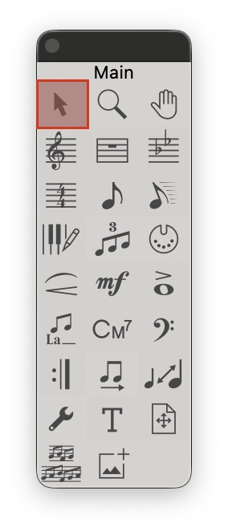

### Select Tools 快捷鍵

要從 `Speedy Tool` 切換到選擇模式可以按 `0`

#### 數字鍵：
1. 在下面複製新的一行
2. 將該行，拆分成不同行
4. 調窄間距
5. 調寬間距
6. 選取範圍 **低一音**
7. 選取範圍 **高一音**
8. 選取範圍 **低八度**
9. 選取範圍 **高八度**

- - -
#### 其他：
- `Enter` 調整小節屬性
- `Command + BackSpace` 在該小節刪除所有音
- `Down` 將該小節換成下一行
- `UP` 將該小節換成上一行

- - -

