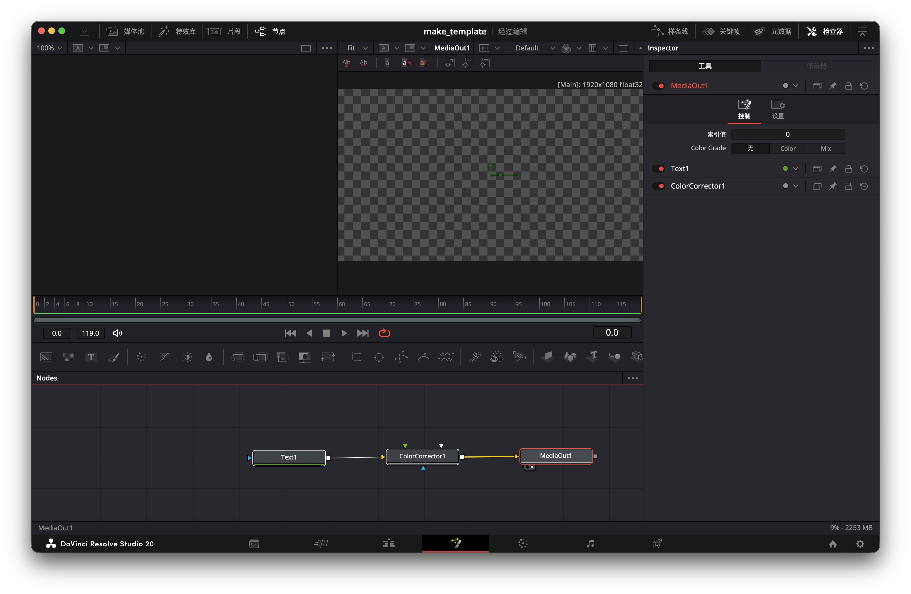
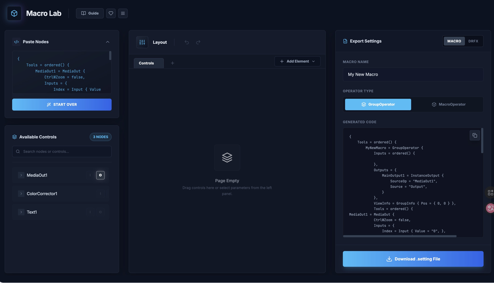

## 前言

最近看到了 **錄錄創作中的新影片** 介紹怎麼製作 `.drfx` 模板...

但是身為一個新手可能不知道建立模板時 ***到底怎麼勾選*** ，於是就有這筆記的誕生！

<iframe width="560" height="315" src="https://www.youtube.com/embed/VY2YMatWbTM?si=PJ8Pj4nH2wlxeBj-" title="YouTube video player" frameborder="0" allow="accelerometer; autoplay; clipboard-write; encrypted-media; gyroscope; picture-in-picture; web-share" referrerpolicy="strict-origin-when-cross-origin" allowfullscreen></iframe>

免費模板系列/如何設定字幕模板/DRFX檔案 [ Davinci Resolve教學 ]

## 利用 MacroLab

就在我頭痛要怎麼勾選才能不用 **一個一個打勾時**，我找到一個好工具！

:::danger MacroLab！
https://macrolab.app/
:::
使用方式非常簡單，只需要貼上節點內容， **然後按 Start** 就可以開始製作了！

### 貼上節點內容

首先，全選所有節點， **確認有選到 MediaOut**
:::warning 注意
#### 用滑鼠點擊MediaOut，讓MediaOut 呈現紅色狀態！
:::

**然後按下  `Ctrl / Command + C` 複製**

#### 貼到網站，按下 Start

### 區域介紹

- 1. 所有節點區
- 2. 製作區
- 3. 會出區

